# Info Wisata

Aplikasi informasi wisata Indonesia berbasis Flutter dengan Firebase sebagai backend. Pengguna dapat mencari, menambahkan, mengedit, dan menghapus destinasi wisata, serta memberi rating dan menyimpan wisata favorit.

**Kelompok 3 — UAS Pemrograman Mobile 2**

## Anggota Kelompok

| No | Nama | NIM |
|----|------|-----|
| 1 | Alfarisi Azhar | 23552011180 |
| 2 | Beni Mochtar Samiraharja | 23552011382 |
| 3 | Ferlya Tabitha Permadi | 23552011131 |
| 4 | Noer Azis Khaerudin | 23552011183 |
| 5 | Susi Martini | 23552011178 |

## Fitur

### Autentikasi
- Login dan Register menggunakan Firebase Authentication (email & password)
- Splash screen dengan auto-redirect ke halaman utama jika sudah login

| Splash | Login |
|--------|-------|
|  | 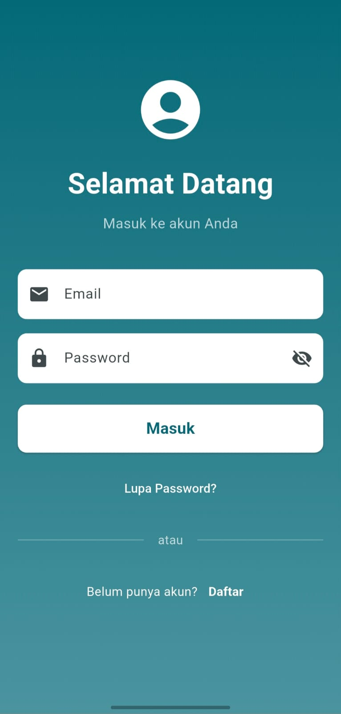 |
| Register | |
| 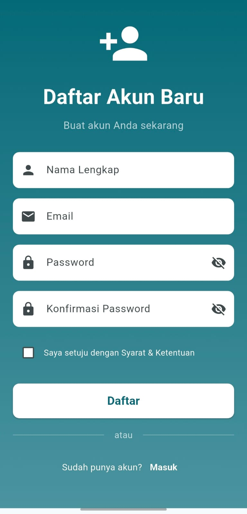 | |

### Beranda
- Carousel slider menampilkan wisata unggulan
- Grid card daftar rekomendasi wisata
- Search bar untuk mencari wisata berdasarkan nama atau lokasi (hasil ditampilkan di halaman terpisah)
- Navigasi ke halaman semua wisata

| Beranda | Semua Wisata |
|---------|--------------|
| 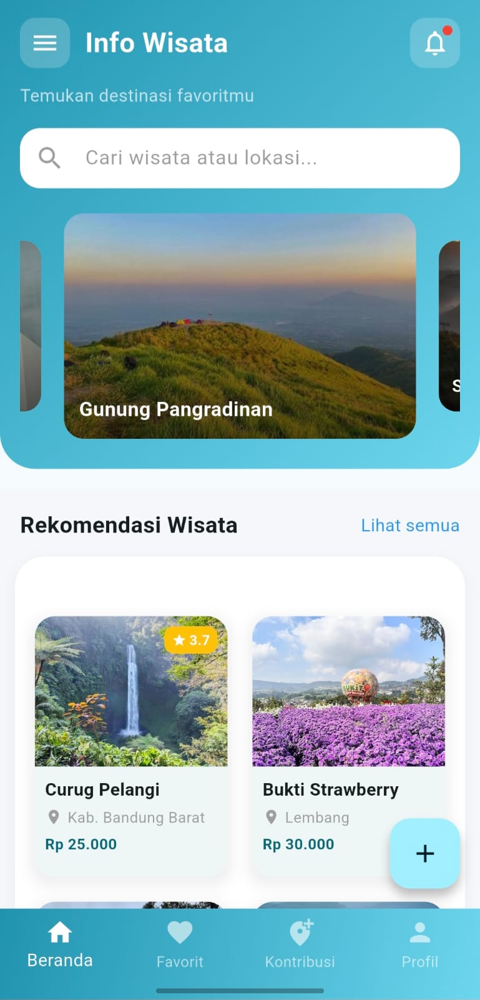 | 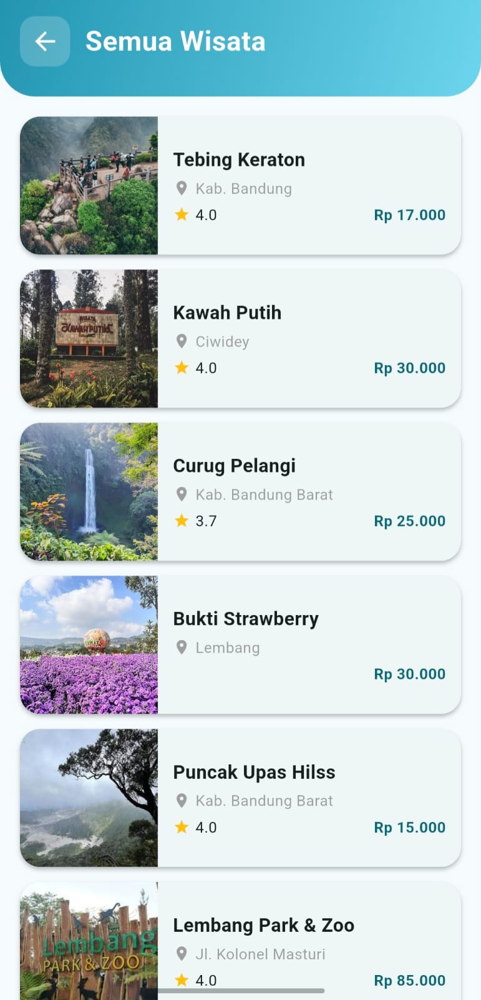 |

### Pencarian
- Halaman hasil pencarian terpisah dengan layout list card
- Filter berdasarkan nama wisata dan lokasi
- Search bar di halaman hasil untuk mengubah query pencarian

| Pencarian | |
|-----------|---|
| 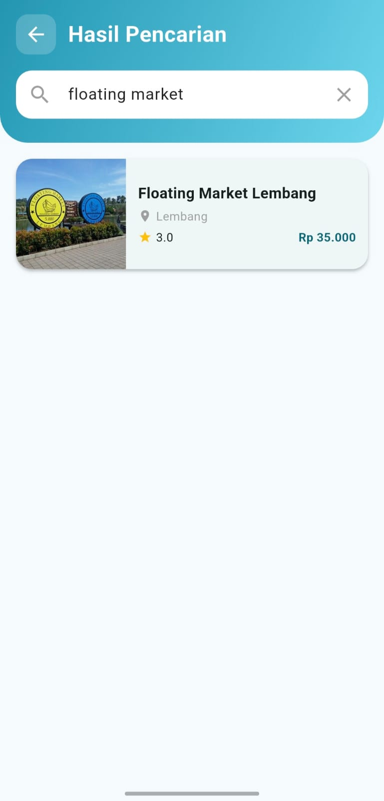 | |

### Detail Wisata
- Menampilkan gambar, nama, lokasi, deskripsi, jam buka, dan harga tiket
- Sistem rating bintang (per-user, dihitung rata-rata)
- Tombol favorit untuk menyimpan wisata

| Detail Wisata | |
|---------------|---|
| 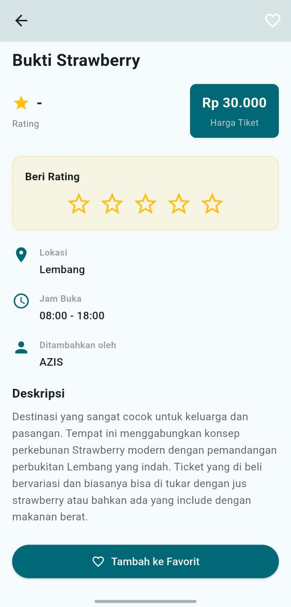 | |

### Wisata Favorit
- Halaman khusus menampilkan daftar wisata yang telah difavoritkan
- Data favorit tersimpan per-user di Firestore

<!-- Screenshot favorit belum tersedia -->

### Kontribusi (CRUD Wisata)
- Tambah wisata baru (nama, deskripsi, lokasi, gambar, harga tiket, jam buka)
- Edit wisata yang sudah ditambahkan
- Hapus wisata (termasuk subcollection ratings)
- Halaman "Kontribusi Saya" menampilkan wisata yang ditambahkan oleh user yang sedang login

| Kontribusi | Tambah Wisata |
|------------|---------------|
| 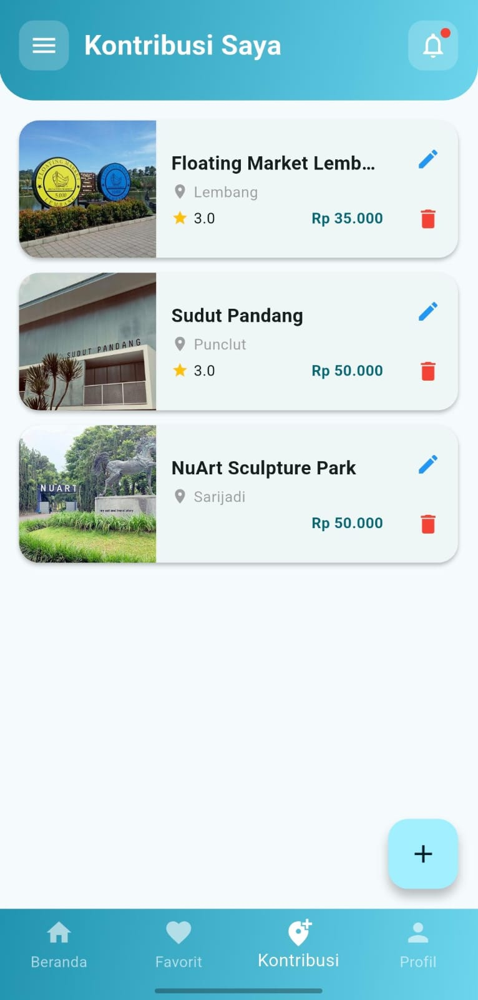 | 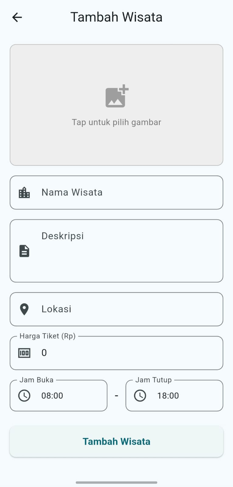 |
| Edit Wisata | |
| 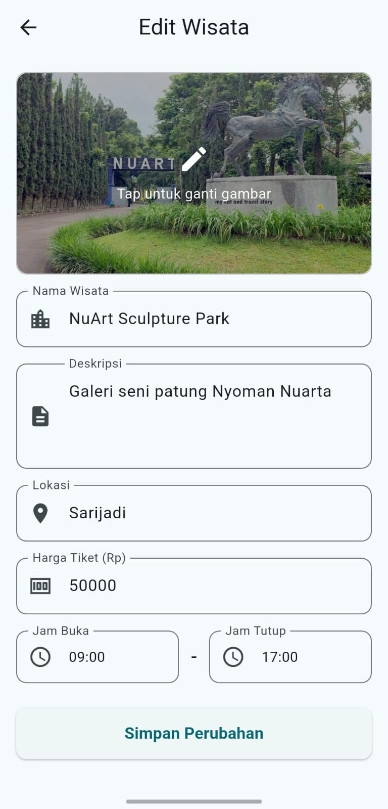 | |

### Notifikasi
- Badge notifikasi pada icon bell di header
- Menampilkan wisata baru yang belum dilihat oleh user

| Notifikasi | |
|------------|---|
| 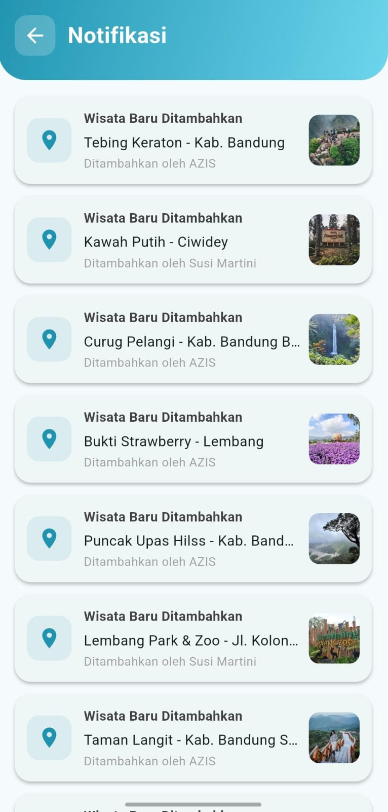 | |

### Profil
- Halaman profil user
- Pengaturan akun

| Profil | Tentang |
|--------|---------|
| 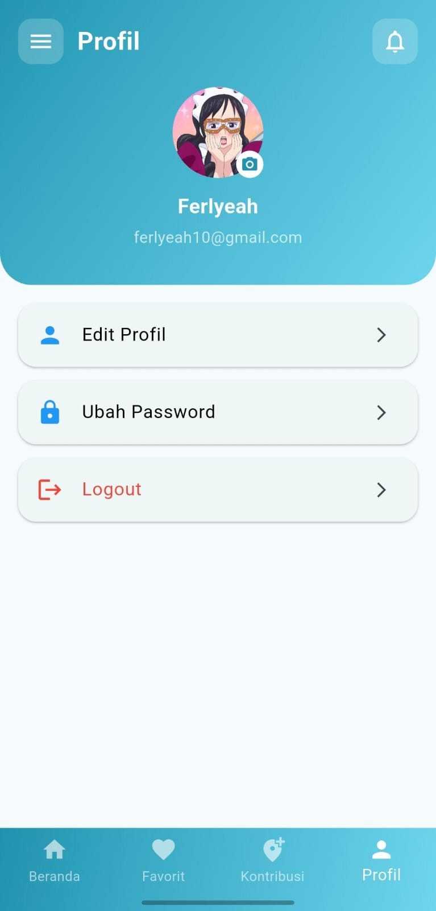 | 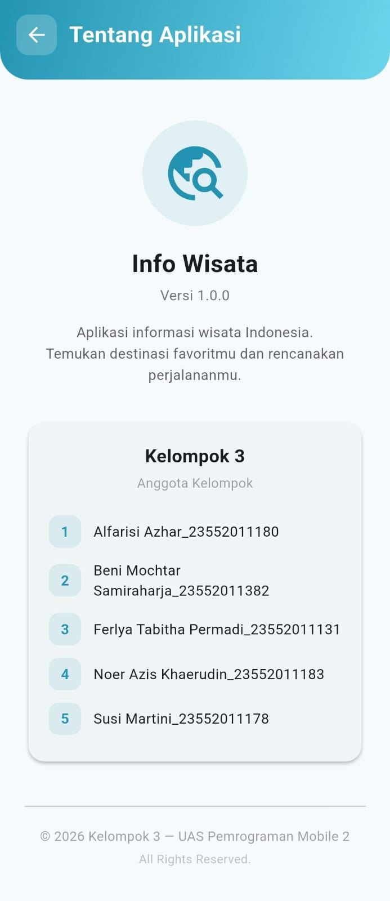 |

### Lainnya
- Navigation drawer dan bottom navigation bar
- Pull-to-refresh pada daftar wisata
- Seed data otomatis saat database kosong
- Halaman "Tentang Aplikasi"

## Teknologi yang digunakan

| Komponen | Teknologi |
|----------|-----------|
| Framework | Flutter (Dart) |
| Autentikasi | Firebase Authentication |
| Database | Cloud Firestore |
| Image Picker | image_picker |
| UI | Material Design 3, Carousel Slider |
